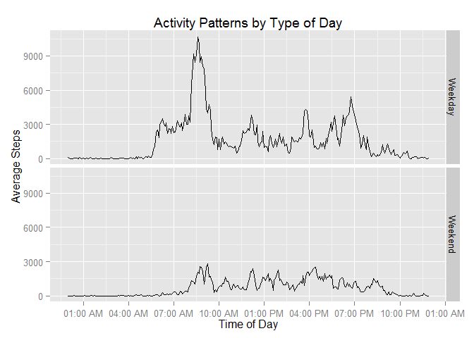

# Reproducible Research: Peer Assessment 1

The following libraries are used in this analysis:

```r
library(magrittr); library(stringr); library(dplyr); library(ggplot2)
```

## Loading and preprocessing the data
The following code loads the raw data and prepares it for analysis


```r
stepData <- read.csv("activity/activity.csv")
#concatenate the date and time fields and covert to POSIX time class for time-based
#manipulations
stepData$date %>% paste(str_pad(stepData$interval,width=4,pad="0")) %>% 
    strptime("%Y-%m-%d %H%M") %>% as.POSIXct ->
    stepData$time
```


## What is mean total number of steps taken per day?
The average number of steps per day is calculated below, ignoring missing values


```r
group_by(stepData,date) %>% summarise(stepsPerDay=sum(steps,na.rm=TRUE)) ->
    stepsPerDay
hist(stepsPerDay$stepsPerDay, xlab="Sum of Daily Steps", 
     main="Histogram of Total Steps per Day")
```

 

```r
meanDailySteps <- prettyNum(round(mean(stepsPerDay$stepsPerDay, na.rm=TRUE), 1), big.mark=",")
medianDailySteps <- prettyNum(median(stepsPerDay$stepsPerDay, na.rm=TRUE), big.mark=",")
```

The average number of daily steps is **9,354.2** and the median is **10,395**.


## What is the average daily activity pattern?
The chart below presents the number of steps taken at each time of day averaged across all days in the data set. For comparison, the grand average across all times of day is included as a red horizontal line.


```r
group_by(stepData, interval) %>% summarise (timeAverage=mean(steps, na.rm=TRUE)) ->
    timeAverage
plot(timeAverage$interval, timeAverage$timeAverage, type="l",
     xlab="Time of Day (minutes past midnight)", 
     ylab="Steps", main="Average Steps Taken by Time")
abline(h=mean(timeAverage$timeAverage, na.rm=TRUE),col="red")
```

 

```r
maxTimeSteps <- round(max(timeAverage$timeAverage, na.rm=TRUE), 1)
timeAverage$interval %>% extract(which.max(timeAverage$timeAverage)) %>%
    str_pad(width=4,pad="0") %>% strptime(format="%H%M") %>% 
    strftime(format="%I:%M %p") ->
    maxTime
```

The highest average steps taken for any time is **206.2** at the time of **08:35 AM**.

## Imputing missing values
Missing values will be imputed by finding the average value for the corresponding time on the corresponding day of the week


```r
stepData <- arrange(stepData,time)
#identify rows with missing values
missings <- is.na(stepData$steps)
#Sum number of missing values
missingCount <- sum(missings)

#identify average steps per interval/dayOfWeek combination
group_by(stepData,dayOfWeek=weekdays(time),interval) %>% 
    summarise(avSteps=mean(steps, na.rm=TRUE)) ->
    avStepsDayAndTime

stepData %>% mutate(dayOfWeek=weekdays(time)) %>%
#use merge to add a column with the corresponding imputed value
    merge(avStepsDayAndTime, by=c("dayOfWeek","interval"), 
          all.x=TRUE, sort=FALSE) %>% arrange(time) %>%
    #replace missing values with their corresponding imputed value
    inset(missings,"steps",extract(.,missings,"avSteps")) %>%
    #drop the no longer needed imputed values column
    select(-avSteps) ->
    #save the results in a new data set
    stepDataImputed

imputedMissingCount <- sum(is.na(stepDataImputed$steps))
```

Before imputation there were **2304** missing values for steps and after imputation there are **0**.


```r
group_by(stepDataImputed,date) %>% summarise(stepsPerDay=sum(steps,na.rm=TRUE)) ->
    stepsPerDay
hist(stepsPerDay$stepsPerDay, xlab="Sum of Daily Steps", 
     main="Histogram of Total Steps per Day")
```

 

```r
meanDailyStepsI <- prettyNum(round(mean(stepsPerDay$stepsPerDay), 1),big.mark=",")
medianDailyStepsI <- prettyNum(median(stepsPerDay$stepsPerDay),big.mark=",")
```

After imputation, the average daily step total is **10,821.2** and the median daily step total is **11,015**. Compared to their values before imputation(mean=9,354.2, median=10,395), the new values are higher. 

## Are there differences in activity patterns between weekdays and weekends?
The chart below compares daily acitivty patterns for weekdays versus weekends. 


```r
stepDataImputed$typeOfDay=factor(NA,levels=c("Weekday","Weekend"))
stepDataImputed[stepDataImputed$dayOfWeek %in% c("Saturday","Sunday"),"typeOfDay"] <- "Weekend"
stepDataImputed[is.na(stepDataImputed$typeOfDay),"typeOfDay"] <- "Weekday"
ggplot(stepDataImputed, aes(x=interval,y=steps)) + 
    stat_summary(fun.y="sum", geom="line") + facet_grid(typeOfDay~.) + 
    labs(x="Time of Day", y="Average Steps") + ggtitle("Activity Patterns by Type of Day")
```

 
